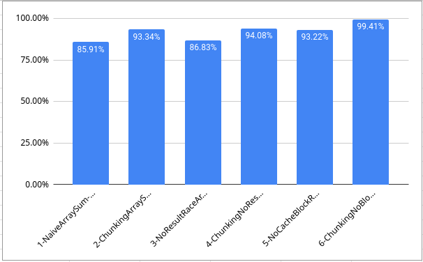
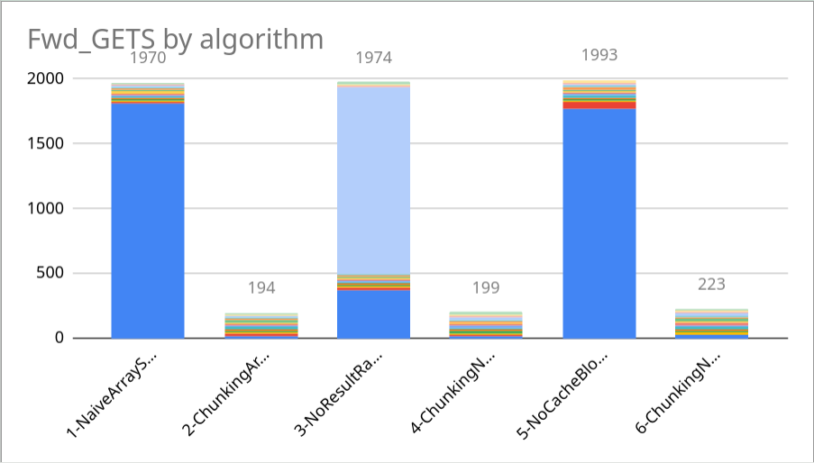
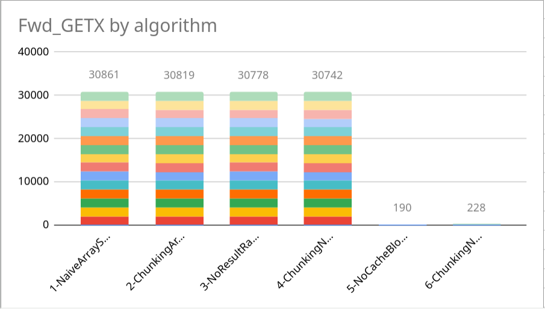
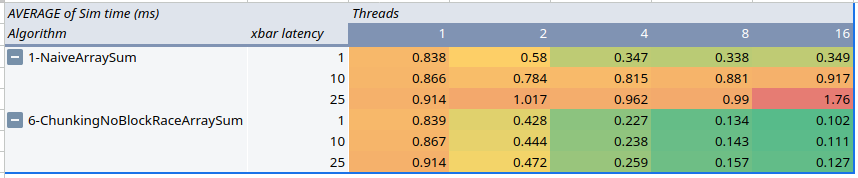

# Cache Coherence HW1

The spreadsheet with the data used can be found here:
- https://docs.google.com/spreadsheets/d/1WDgLFqU8LjNjcCGEVGp0CtAdB828Yn0poPHu3G3HMVE/edit?usp=sharing

## Question 1

Increasing the amount of threads hurts performance:

|              | Threads: 1    | Threads: 2   | Threads: 4   |
| ------------ | ------------- | ------------ | ------------ |
| Run 1        | 1.48879       | 2.4514       | 2.58782      |
| Run 2        | 1.50861       | 2.78768      | 3.10053      |
| Run 3        | 1.50799       | 3.31243      | 3.28561      |
| Run 4        | 1.57918       | 3.51975      | 2.78975      |
| Run 5        | 1.51898       | 2.85706      | 2.8987       |
| Run 6        | 1.51801       | 3.71122      | 3.04339      |
| Run 7        | 1.49075       | 2.50407      | 2.85003      |
| Run 8        | 1.48298       | 2.5821       | 3.46224      |
| Run 9        | 1.50055       | 3.03754      | 3.26117      |
| Run 10       | 1.52232       | 3.10968      | 2.77351      |
|              |               |              |              |
| AVERAGE (ms) | 1.511816      | 2.987293     | 3.005275     |
| STDDEV       | 0.02727485297 | 0.4310802055 | 0.2735176617 |

The program takes longer (average gets worse) as we add more threads!

## Question 2

Adding more threads improves performance, but with diminishing returns.

|              | Threads: 1   | Threads: 2   | Threads: 4   |
| ------------ | ------------ | ------------ | ------------ |
| Run 1        | 1.52016      | 0.976824     | 0.948854     |
| Run 2        | 1.44118      | 1.023910     | 1.013120     |
| Run 3        | 1.52972      | 0.955528     | 1.008810     |
| Run 4        | 1.52534      | 1.033450     | 0.633181     |
| Run 5        | 1.04106      | 0.522820     | 0.522483     |
| Run 6        | 1.02966      | 0.412569     | 0.395760     |
| Run 7        | 1.01126      | 0.373606     | 0.306572     |
| Run 8        | 1.00377      | 0.359886     | 0.276813     |
| Run 9        | 1.02483      | 0.323244     | 0.260330     |
| Run 10       | 1.01814      | 0.388930     | 0.279585     |
|              |              |              |              |
|              | Threads: 1   | Threads: 2   | Threads: 4   |
| AVERAGE (ms) | 1.214512     | 0.6370767    | 0.5645508    |
| STDDEV       | 0.2506192018 | 0.3150606284 | 0.3169895822 |

Going from one thread to two halves the average, but going to 
four only gives a 0.1ms speedup

As a side note, my computer has four cores with two threads each. 
Using eight threads ends up being worse than using just one.

## Question 3

The most important optimization seems to be number 5: knowing the cache size.
All other optimizations don't improve performance when using more than one thread.

I suspect the cache coherency protocol is to blame here. While each thread may 
be writing to different memory locations, the cache only tracks modifications 
and usage on a block level. So when another thread needs to *read* it's own 
counter, the cache will try to update the entire block (pausing the thread 
in the process)

## Question 4

The algorithm 6 goes from taking 0.867 ms down to 0.111 ms, but the algorith 1 
didn't improve at all.

Comparison between my computer vs GEM5 prediction:

Numbers on 'My Computer' column are the average among 10 tests run on my personal computer

All numbers are in milliseconds

### Algorithm 1

|            | My Computer | GEM5  |
| ---------- | ----------: | ----- |
| Threads: 1 |    1.355400 | 0.866 |
| Threads: 2 |    2.835447 | 0.784 |
| Threads: 4 |    2.401253 | 0.815 |

### Algorithm 6
		
|            | My Computer | GEM5  |
| ---------- | ----------: | ----- |
| Threads: 1 |   1.4385132 | 0.867 |
| Threads: 2 |   0.9674114 | 0.444 |
| Threads: 4 |   0.7464129 | 0.238 |

## Question 5

Chunking the array raised the average hit ratio from 86% (on the naive 
algorithm) up to 93% (on the chunking array algorithm)

When applying this optimization to the third algorithm we can see a similar 
improvement, going from 89% (algorithm 3) up to 94% (algorithm 4)

Numbers are the average among the 16 cache controllers

The complete data used can be seen on sheet "question-5" on the provided spreadsheet

## Question 6

The graph shows how chunking the array reduces the total shared cache blocks to 
just one tenth!

The complete data used can be seen on sheet "question-6" on the provided spreadsheet

## Question 7

Only algorithm 5 resulted in an improvement in this statistic. This is expected 
as spreading the result addresses resulted in each thread writing to different 
cache blocks. Now when a thread writes, the cache controller doesn't have to 
request exclusive access to a shared cache block.

## Question 8

I believe the most important characteristic is write sharing.
The biggest performance boost comes from padding the result array, algorithm 5 
runs in 0.145 ms while algorithms 1 and 2 take 1 ms. 
This is due to the fact that when writing the result, the cache controller 
needs exclusive access to the whole cache block. 

## Question 9

As we can see from the table above, the performance of the naive implementation 
degrades significantly the more we increase the cache-to-cache latency, 
going from taking 0.35 ms up to 1.76 ms when running with 16 threads.
In comparison the sixth algorithm doesn't vary that much, when running with 
16 threads there is only a 0.02 ms difference between the fastest and the 
slowest cache-to-cache xbar

