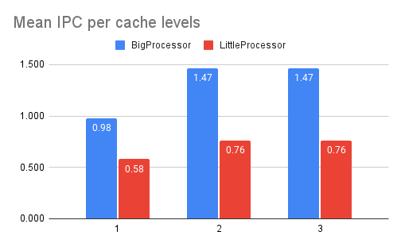
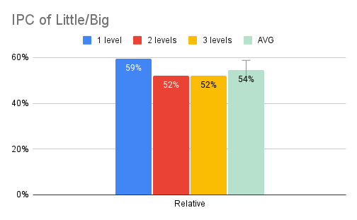
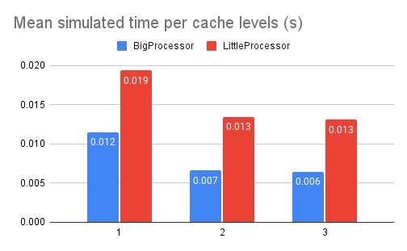

The spreadsheet with the data used can be found here:
- https://docs.google.com/spreadsheets/d/1b7aAUZedC0BTX7-7h--cje8el-T20WwDrHaomq-0_0s/edit?usp=sharing

The graph shows the mean IPC for each configuration of processor/caches-levels.
Numbers are rounded to two decimals to save space on the graph.
The raw data can be found on the spreadsheet

As we can see on the graph, going from just one cache level to two introduces a significant performance boost of around 50%, raising the average IPC from 0.98 to 1.47 on the BigProcessor.

Improving the caches did widen the gap between the Big and the Little processors, but the relative performance stayed the same. 
The LittleProcessor has an IPC that is 54%±4.29 of the BigProcessor.

Finally, introducing a third level of cache did not offer an improvement as big as the second level did; with both metrics staying relatively the same

In conclusion all 
